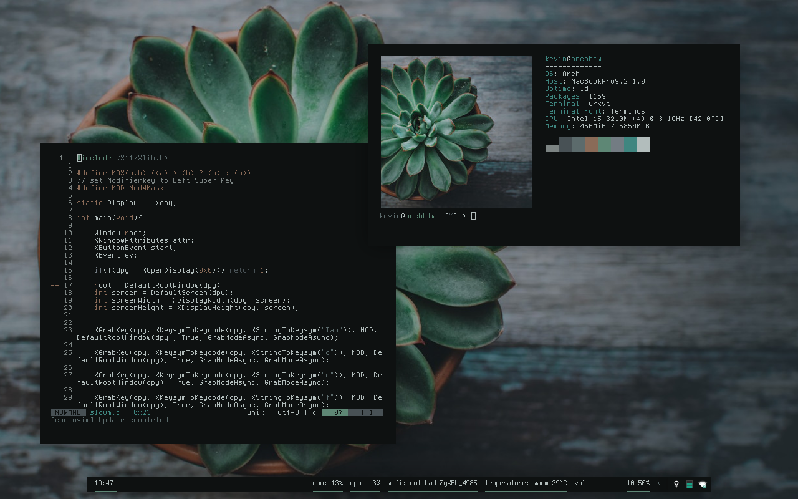

# README

So I was fiddling around with [sowm](https://github.com/dylanaraps/sowm) to get autofocus on mouse hover working (which was quite easy) and COVID-19 has blessed me with some more free time so I decided to try my hand at some XLib programming in C as well.

The code in the screenshot is me trying to reimplement sowm using tinywm as a starting point.

### Details

wm: [sowm](https://github.com/dylanaraps/sowm)
terminal emulator: urxvt
bar: polybar
wallpaper: from the r/unixporn discord server (Im PlainOldCheese over there btw) but heres some links [succulent](https://github.com/torvim/pape/blob/master/moody_tumblr_vibes/pot.jpg) [trees](https://i.imgur.com/zP5ZP4i.jpg).

## dependencies

or at least these are the programs i use. 🤷‍♂️

- dunst
- pywal
- sowm
- redshift
- polybar
- oomox
- urxvt
- picom
- ranger
- rofi
- sxhkd
- neovim
- neofetch
- xfce4-power-manager
- mpbfan
- feh
- zathura
